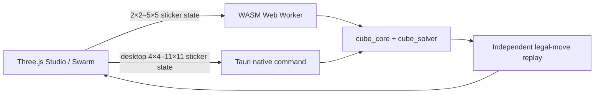

<div align="center">
  

# Cube Solver

**A local-first N×N cube solver studio built with Rust, WebAssembly, Tauri, and evolutionary computing.**

Create a legal scramble, solve from the visible stickers alone, and watch only solutions that independently replay to solved.

[](https://github.com/AdamNolle/Cube-Solver/actions/workflows/ci.yml)
[](https://github.com/AdamNolle/Cube-Solver/actions/workflows/desktop.yml)
[](https://www.rust-lang.org/)

</div>

> [!IMPORTANT]
> **Cube Solver only offers sizes it can genuinely solve and replay-verify.**
> The native desktop app supports **2×2–11×11**. The standalone browser build supports **2×2–5×5**. Larger sizes are intentionally hidden because their time and memory costs are not yet reliable enough for a product promise.

## What you can do

- **Generate a scramble** using cryptographically strong randomness where available.
- **Build your own scramble** by typing standard notation such as `R U R' U'`, `Rw`, or `3Rw2`.
- **Turn the cube yourself** with accessible face, direction, and wide-turn controls.
- **Solve without revealing the scramble history** to the Worker or native solver.
- **Cancel long searches or replays** without leaving the visual cube and Rust cube out of sync.
- **Watch evolutionary computing** on real 2×2/3×3 candidate populations.
- **Inspect truthful reduction telemetry** while 4×4–11×11 cubes are solved.

## A 60-second tour

1. **Choose a supported size.** Desktop offers 2×2 through 11×11; the browser stops at 5×5.
2. **Create the state.** Press **Scramble**, enter an algorithm, or turn faces manually.
3. **Press Solve.** The solver receives the complete sticker-color state—not the scramble sequence.
4. **Wait or cancel.** Small cubes run in a Web Worker; desktop reduction runs on a cancellable native Rust thread.
5. **Verify and replay.** A path is accepted only after its legal moves independently replay to solved.
6. **Open Swarm.** Small cubes show live evolutionary trials; larger supported cubes show the real reduction pipeline.

## What solves each cube?

| Where | Size | Solver path | Execution |
|---|---:|---|---|
| Browser + desktop | **2×2** | Bounded meet-in-the-middle, beam, and island-GA strategies; shortest verified candidate wins | WASM Worker |
| Browser + desktop | **3×3** | Two-phase Kociemba-style search | WASM Worker |
| Standalone browser | **4×4–5×5** | Deterministic reduction | WASM Worker |
| Native desktop | **4×4–11×11** | Centers → edge wings → parity → reduced 3×3 | Native Rust command thread |

The 3×3 path is a fast two-phase solver, **not an optimal solver**. The 4×4+ path is deterministic reduction, while evolutionary search remains educational and supplemental rather than the completeness mechanism.

### Why stop at 11×11 on desktop?

A larger cube is easy to draw, but drawing one is not the same as solving one.

Every advertised size must pass all of these gates:

- legal-move solving from sticker colors,
- independent replay to solved,
- bounded memory and runtime on ordinary machines,
- cancellation without state corruption,
- repeatable tests on Linux, macOS, and Windows.

Research-only replay evidence currently reaches beyond the product ceiling, including strict runs through N=44, but frontier cases can consume substantial time and memory. The UI therefore stops at the range we can defend as a real desktop feature. See [`docs/ARBITRARY_N_RESEARCH.md`](docs/ARBITRARY_N_RESEARCH.md) for the evidence and remaining limits.

## Build your own scramble

### Type move notation

Examples:

```text
R U R' U'
R2 F2 U2
Rw U 3Rw2 F'
```

Supported notation:

- faces: `U D L R F B`,
- counter-clockwise suffix: `'`,
- half-turn suffix: `2`,
- wide turns: `Rw` or `3Rw`,
- lowercase wide-turn aliases such as `r`.

Wide turns are available on 4×4 and larger cubes and are limited to half the cube width. That keeps the fixed face orientation compatible with the supported solver paths. Custom 2×2 sequences are capped at nine moves so the exact bounded search can always search at least as deep as the entered sequence.

### Turn faces interactively

Choose:

1. the turn width,
2. `90°`, `−90°`, or `180°`,
3. one of `U D L R F B`.

Each press applies a real legal move to both the rendered cube and the Rust cube model. **Undo last manual turn** reverses the most recent interactive move. Applying notation starts from solved; interactive turns can be added to the current scramble.

## Evolutionary-computing concepts

Evolutionary computing asks: _what if possible solutions could breed better solutions?_

| Concept | Meaning in Cube Solver |
|---|---|
| **Genome** | A candidate sequence of legal cube moves |
| **Population** | A collection of candidate move sequences |
| **Fitness** | Primarily how many stickers remain incorrect, with a small preference for shorter genomes in the solver-lane GA |
| **Selection** | Tournament selection favors stronger candidates without always choosing the same parent |
| **Mutation** | Insert, remove, or replace moves |
| **Crossover** | Join a prefix from one candidate to a suffix from another |
| **Island model** | Several populations explore independently instead of collapsing onto one idea |
| **Migration** | Strong candidates occasionally move between islands |
| **Stagnation restart** | A stuck population keeps its best candidate but refreshes the rest |
| **Convergence** | A candidate reaches a solved, replay-verified state |

### What Swarm really shows

For **2×2 and 3×3**, every card is a live evolutionary trial synchronized to the Studio cube. The cards show sticker mismatch, genome length, mutation/crossover origin, and plateau behavior. Green means that trial reached solved.

The UI passes the local scramble moves to Swarm only to reconstruct the shared starting cube. Evolutionary candidates search from that resulting state; they do not receive or return a stored inverse.

For **4×4–11×11**, Swarm does **not** pretend evolution is solving the cube. It switches to deterministic-reduction telemetry: elapsed activity, the centers/edges/reduced-3×3 pipeline, cancellation, and final replay proof.

## Verification and privacy

Cube Solver is local-first:

- no cloud solver,
- no analytics runtime,
- no external fonts or JavaScript at runtime,
- vendored three.js,
- an offline-focused Tauri content-security policy.

For normal Studio solves, the Worker or Tauri command receives:

```text
N + exactly 6 × N² sticker-color values
```

It does **not** receive the scramble sequence. Returned moves are replayed from the original state, and success is reported only if replay reaches solved.

This is an implementation fairness boundary—not a cryptographic proof—but it prevents the normal solver path from simply reading and reversing a hidden scramble history.

## Architecture



| Path | Responsibility |
|---|---|
| `crates/cube_core` | Sticker cube, legal face/wide/slice turns, scramble primitives |
| `crates/cube_solver` | Two-phase 3×3, bounded 2×2 strategies, EC workers, deterministic reduction |
| `crates/cube_wasm` | WASM bridge, Swarm population, sticker-only solve boundary |
| `src-tauri` | Native desktop shell and cancellable 4×4–11×11 solve commands |
| `tools/design-source.txt` | Authored Studio/Swarm interface |
| `tools/gen-index.py` | Generates `web/index.html` and wires the real solver into the interface |
| `web/solver-worker.js` | Off-main-thread browser/WASM solving |
| `crates/solver_lab_app` | Legacy/experimental egui frontend |

## Run locally

### Prerequisites

- stable Rust,
- Python 3,
- the `wasm32-unknown-unknown` target,
- [`wasm-pack`](https://rustwasm.github.io/wasm-pack/),
- [Tauri CLI v2](https://v2.tauri.app/start/prerequisites/),
- platform-specific Tauri system dependencies.

```sh
rustup target add wasm32-unknown-unknown
cargo install tauri-cli --version '^2' --locked
```

### Native desktop app

```sh
cd src-tauri
cargo tauri dev
```

The Tauri configuration builds the WASM package automatically before development and production builds.

```sh
cd src-tauri
cargo tauri build
```

### Standalone browser

```sh
python3 tools/build-wasm.py
python3 -m http.server -d web 8000
```

Then open <http://localhost:8000>. ES modules and WebAssembly must be served over HTTP; opening `web/index.html` through `file://` will not work.

### Legacy Solver Lab

```sh
cargo run --release -p solver_lab_app
```

The egui Solver Lab is an experimental second frontend with its own controls, local SQLite history, and wall view. It should not be confused with the recommended Tauri Studio documented above.

## Developer notes

### Canonical verification gate

```sh
cargo fmt --all -- --check
python3 tools/gen-index.py --check
python3 tools/frontend-smoke.py
cargo clippy --workspace --all-targets --all-features -- -D warnings
cargo test --workspace
cargo build -p cube_wasm --target wasm32-unknown-unknown
cargo build --release --workspace
cargo check --manifest-path src-tauri/Cargo.toml
node --check web/solver-worker.js
```

After generating `web/pkg/`, also run:

```sh
node tools/wasm-runtime-smoke.mjs
```

Slow reduction corpora and frontier research tests are intentionally ignored by routine `cargo test`; release workflows invoke the advertised-range gates explicitly.

### Generated frontend

Do not hand-edit `web/index.html`.

1. Edit `tools/design-source.txt` for authored layout/interaction changes.
2. Edit `tools/gen-index.py` for solver wiring and runtime behavior.
3. Run `python3 tools/gen-index.py`.
4. Run `python3 tools/frontend-smoke.py`.

`src-tauri/build.rs` rejects missing or obviously incomplete generated output. CI’s exact `gen-index.py --check` gate detects generator drift.

### Two Cargo workspaces

The root Rust workspace contains the cube crates and legacy app. `src-tauri` is a separate workspace. Run Tauri-specific format, Clippy, tests, and packaging commands from `src-tauri/` or with `--manifest-path`.

### Troubleshooting

Avoid keeping active build trees in a cloud-synchronized folder. Sync tools can duplicate or replace generated sources while Tauri embeds them, producing a package from stale assets.

## Releases

The release workflow produces three native desktop downloads:

- Windows x86_64: NSIS setup `.exe`,
- macOS universal: `.dmg`,
- Linux x86_64: `.flatpak` bundle using the GNOME 50 runtime.

The first `v0.1.0` release is prepared as a **draft** until trusted Apple notarization and Windows publisher-signing credentials are configured. The Flatpak is a single-file application bundle; Flatpak downloads its declared GNOME runtime from Flathub when needed.

Unsigned development artifacts can be structurally valid and checksum-verified while still triggering Gatekeeper or SmartScreen warnings. Checksums prove file integrity; they do not establish a trusted publisher identity.

See [`docs/RELEASING.md`](docs/RELEASING.md) for artifact contracts, validation steps, signing requirements, and the draft-to-public checklist.
